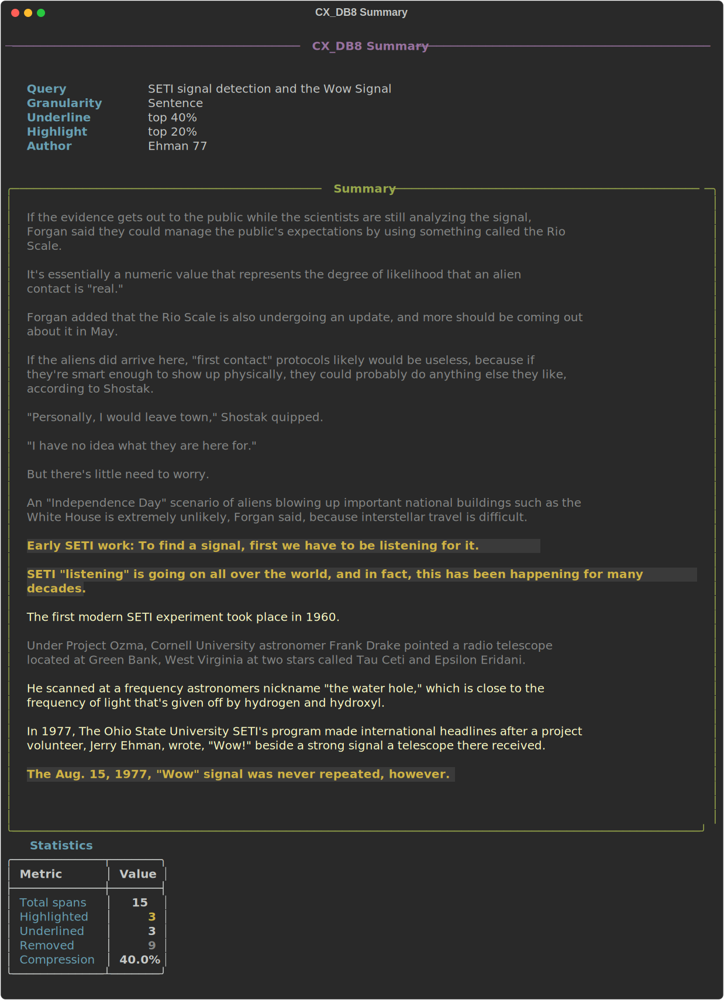
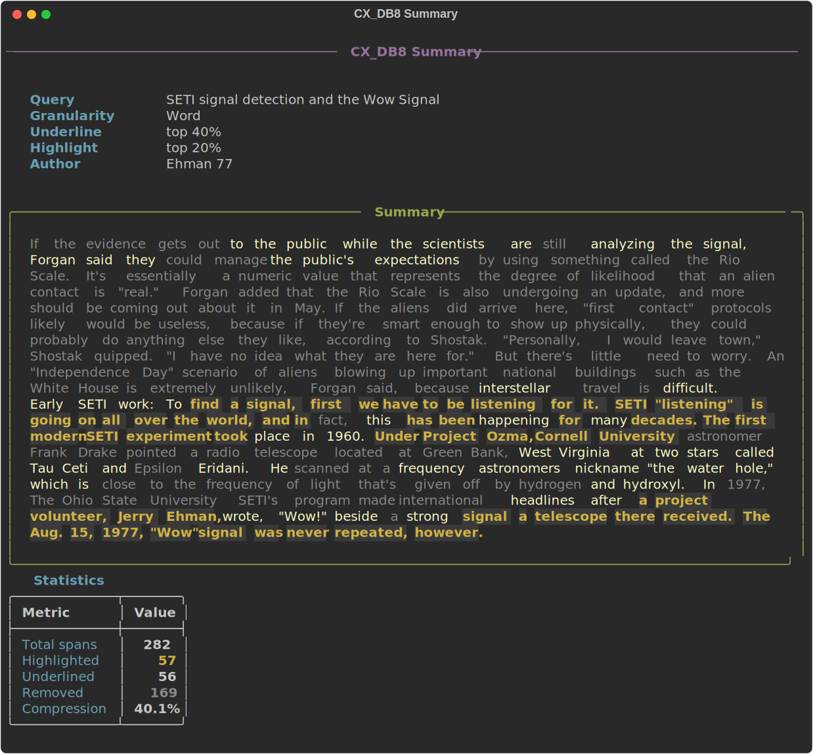

# CX_DB8

[](https://opensource.org/licenses/MIT)
[](https://www.python.org/downloads/)
[](https://docs.astral.sh/uv/)

**Unsupervised, contextual, extractive summarizer** built for competitive debate evidence — and useful for any document.

CX_DB8 uses modern sentence embeddings to find the most relevant words, sentences, or paragraphs in a document relative to a query. It highlights and underlines text by semantic similarity, producing beautiful terminal output, Word documents, HTML, and SVG exports.


## Features

- **Three granularity levels** — word, sentence, or paragraph extraction
- **Any sentence-transformer model** — swap models with a single flag
- **Beautiful Rich TUI** — styled terminal output with panels, tables, and color-coded highlights
- **Multiple exports** — Word (.docx), HTML, and SVG output formats
- **Interactive mode** — process multiple cards in sequence, save all to one document
- **3D visualization** — explore the embedding space with interactive matplotlib + UMAP plots
- **Fast** — default model runs on CPU in seconds, no GPU required

## Quick Start

### Install with UV (recommended)

```bash
uv tool install git+https://github.com/Hellisotherpeople/CX_DB8.git
```

Or clone and install locally:

```bash
git clone https://github.com/Hellisotherpeople/CX_DB8.git
cd CX_DB8
uv sync
```

### Install with pip

```bash
pip install git+https://github.com/Hellisotherpeople/CX_DB8.git
```

### Run the demo

```bash
cx-db8 demo
```

## Usage

### Basic summarization

```bash
# From a file
cx-db8 run --file evidence.txt --query "nuclear war causes extinction"

# Pipe text in
cat evidence.txt | cx-db8 run --query "economic collapse"

# Interactive prompt (paste text, Ctrl-D to finish)
cx-db8 run
```

### Granularity levels

```bash
# Sentence level (default) — best for most use cases
cx-db8 run -f card.txt -q "hegemony decline" -g sentence

# Word level — token-level extraction with context windows
cx-db8 run -f card.txt -q "hegemony decline" -g word

# Paragraph level — coarse-grained extraction
cx-db8 run -f card.txt -q "hegemony decline" -g paragraph
```

### Control thresholds

```bash
# Underline top 30%, highlight top 15%
cx-db8 run -f card.txt -q "warming" -u 70 -H 85

# Aggressive: only keep top 10%
cx-db8 run -f card.txt -q "warming" -u 90 -H 95
```

### Export formats

```bash
# Word document
cx-db8 run -f card.txt -q "deterrence" --docx summary.docx

# HTML
cx-db8 run -f card.txt -q "deterrence" --html summary.html

# SVG screenshot
cx-db8 run -f card.txt -q "deterrence" --svg summary.svg

# All at once
cx-db8 run -f card.txt -q "deterrence" --docx out.docx --html out.html --svg out.svg
```

### Choose a model

```bash
# List recommended models
cx-db8 models

# Use a specific model
cx-db8 run -f card.txt -q "query" --model all-mpnet-base-v2
```

### Interactive mode

Process multiple cards in a session and save all summaries to a Word document:

```bash
cx-db8 run --interactive
```

### 3D Visualization

```bash
# Install visualization dependencies
uv pip install cx-db8[viz]

# Run with visualization
cx-db8 run -f card.txt -q "query" --viz
```


## How It Works

CX_DB8 is an **unsupervised extractive summarizer** that works by computing semantic similarity between a query and each unit of text:

1. **Encode the query** into a dense vector using a sentence-transformer model
2. **Segment the text** into spans (words with context windows, sentences, or paragraphs)
3. **Encode each span** into the same embedding space
4. **Score each span** by cosine similarity to the query vector
5. **Threshold** using percentile-based cutoffs to determine what gets highlighted, underlined, or removed

For **word-level** summarization, each word is embedded along with its surrounding context window (default ±10 words), preserving contextual meaning rather than treating each word in isolation.

### Sentence-Level Summary



### Word-Level Summary



## Configuration

All settings are available as CLI flags. Run `cx-db8 run --help` for full documentation:

| Flag | Default | Description |
|------|---------|-------------|
| `-f, --file` | stdin | Input text file |
| `-q, --query` | interactive | Card tag / query |
| `-g, --granularity` | sentence | word, sentence, or paragraph |
| `-u, --underline` | 70 | Underline percentile (1-99) |
| `-H, --highlight` | 85 | Highlight percentile (1-99) |
| `-m, --model` | all-MiniLM-L6-v2 | Sentence-transformer model |
| `-w, --word-window` | 10 | Context window for word-level |
| `--docx` | — | Export as Word document |
| `--html` | — | Export as HTML |
| `--svg` | — | Export as SVG screenshot |
| `--viz` | false | Show 3D embedding plot |
| `-i, --interactive` | false | Interactive loop mode |

## Development

```bash
git clone https://github.com/Hellisotherpeople/CX_DB8.git
cd CX_DB8
uv sync --extra dev
uv run pytest
```

### Record demo GIFs

Requires [VHS](https://github.com/charmbracelet/vhs):

```bash
vhs demo.tape
vhs demo_help.tape
```

## Background

In American competitive cross-examination debate (Policy Debate), debaters summarize evidence by underlining and highlighting the most important parts of source documents. This manual process is what CX_DB8 automates.

The original version (2018-2019) used TensorFlow Hub's Universal Sentence Encoder and Flair embeddings. This v2.0 rewrite modernizes the stack with sentence-transformers, Rich TUI, and UV packaging while preserving the core algorithm.

A webapp version implementing similar functionality is available at [Hugging Face Spaces](https://huggingface.co/spaces/Hellisotherpeople/Unsupervised_Extractive_Summarization).

## License

MIT
